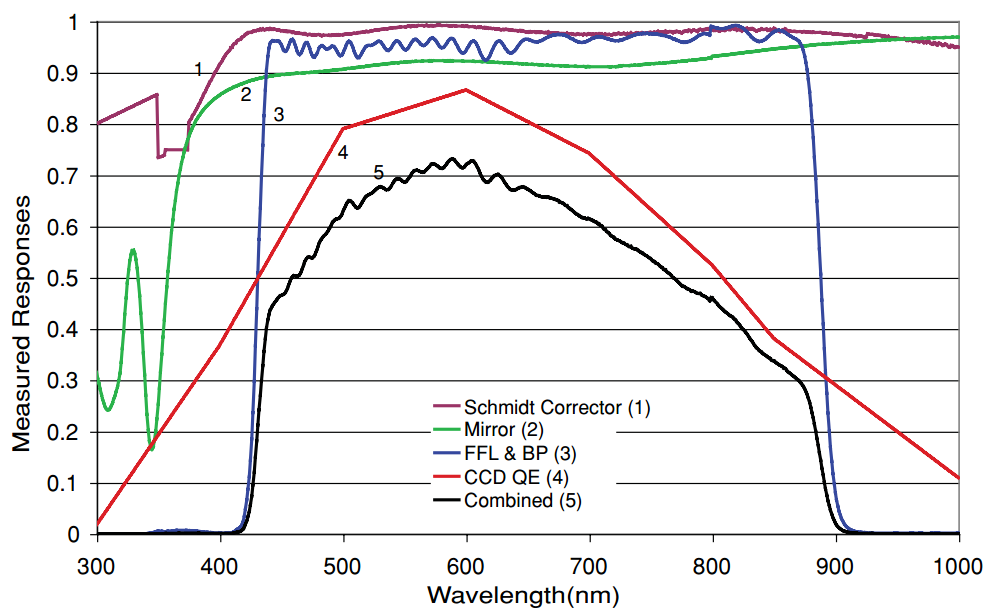
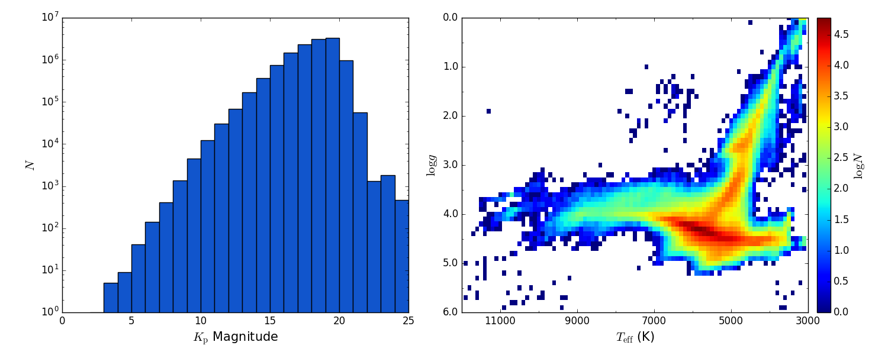

Catalogues
==========

Summaries
---------
**Useful functions on searching stars in catalogues (find_catalog module)**

.. currentmodule:: stella.catalog.find_catalog

.. autosummary::
    find_HIP
    find_HIP2
    find_KIC

.. _catalog_hip:

Hipparcos Catalogue (HIP)
--------------------------
The Hipparcos Catalogue (`I/239
<http://vizier.u-strasbg.fr/viz-bin/VizieR-3?-source=I/239>`_, Perryman et al.
1997 [#Perryman1997]_) is the product of the *Hipparcos* satellite of the
European Space Agency (ESA).
During its four years of operation from Novermber 1989 to March 1993, the
satellite measured accurate triangular parallaxes and proper motions for a large
number of stars.
The limiting magnitude is *V* ~ 12.4, and the *V* magnitude completeness is 7.3
~ 9.0, depending on the galactic latitude and spectral type.
The median error in parallax is 0.97 mas for stars with *Hipparcos* magnitudes
brighter than 9.
The published astrometric solutions are given in International Celestial
Reference System (ICRS) at epoch J1991.25.

.. currentmodule:: stella.catalog
.. autosummary::
    find_catalog.find_HIP

.. _catalog_hip2:

Hipparcos Catalogue New Reduction (HIP2)
-----------------------------------------
This catalogue is the results of the new reduction (van Leeuwen 2007
[#vanLeeuwen2007]_) of the astrometric data obtained by the
*Hipparcos* satellite.

.. currentmodule:: stella.catalog
.. autosummary::
    find_catalog.find_HIP2

.. _catalog_kic:

Kepler Input Catalog (KIC)
---------------------------
The Kepler Input Catalog (`V/133
<http://vizier.u-strasbg.fr/viz-bin/VizieR-3?-source=V/133>`_, Kepler Mission
Team, 2009) contains photometric and physical data of over 13 million objects in
the *Kepler* field of view.
The photometric observations were taken with the 1.2m reflector at the Fred
Lawrence Whipple Observatory.
Seven bands were used, including the SDSS *u*, *g*, *r*, *i*, *z* filters,
*G*:sub:`red` band centered at 432 nm, and *D*\ 51 band centered at 510 nm.
But two of them (*u* and *D*\ 51) are available only for a small subset of the
data.
The magnitudes in SDSS bands were calibrated using 284 standard stars in common
with SDSS DR1.
The *Kepler* magnitudes as defined by the *Kepler* response curve centered at
665 nm were computed by linear combinations of *g*, *r*, *i* magnitudes.
The stellar physical parameters (*T*:sub:`eff`, log\ *g*, log\ *Z* and
*E*:sub:`B−V`) were estimated using Bayesian method to match the observed colors
to the Castelli & Kurucz 2004 [#Castelli2004]_ stellar atmosphere models.
For details, see Brown et al. 2011 [#Brown2011]_.

There are some known biases on the physical parameters in the Kepler Input
Catalog.
We refer the readers to Pinsonneault et al. 2012 [#Pinsonneault2012]_ for an
improved temperature scale and Dong et al. 2014 [#Dong2014]_ for an improved
metallicity scale.
Besides, Huber et al. 2014 [#Huber2014]_ derived parameters for 196,468 stars
using Kepler photometric data, including 11,532 unclassified targes in this
catalogue.

    Response curves of the *Kepler* telescope. From Koch et al. 2010
    [#Koch2010]_

    
    Histogram of *K*:sub:`p` magnitudes (*left*) and *T*:sub:`eff` - log\ *g*
    diagram (*right*)

.. currentmodule:: stella.catalog
.. autosummary::
    find_catalog.find_KIC

References
------------
.. [#Brown2011] Brown et al., 2011, *AJ*, 142, 112 :ads:`2011AJ....142..112B`
.. [#Castelli2004] Castelli & Kurucz, 2004, arXiv: astrop-h/0405087 :arXiv:`astro-ph/0405087`
.. [#Dong2014] Dong et al., 2014, *ApJ*, 789, L3 :ads:`2014ApJ...789L...3D`
.. [#Huber2014] Huber et al., 2014, *ApJS*, 211, 2 :ads:`2014ApJS..211....2H`
.. [#Koch2010] Koch et al., 2010, *ApJ*, 713, L79 :ads:`2010ApJ...713L..79K`
.. [#Perryman1997] Perryman et al., 1997, *A&A*, 323, L49 :ads:`1997A%26A...323L..49P`
.. [#Pinsonneault2012] Pinsonneault et al., 2012, *ApJS*, 199, 30 :ads:`2012ApJS..199...30P`
.. [#vanLeeuwen2007] van Leeuwen, 2007, *A&A*, 474, 653 :ads:`2007A%26A...474..653V`
