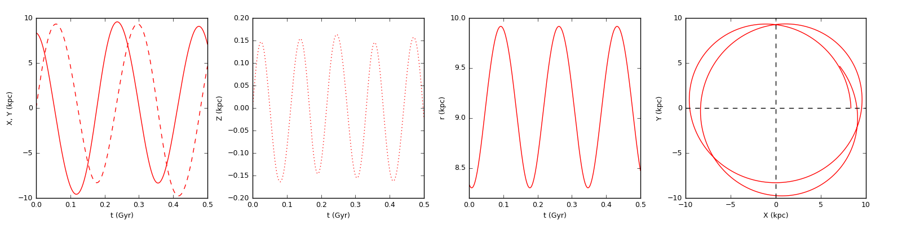
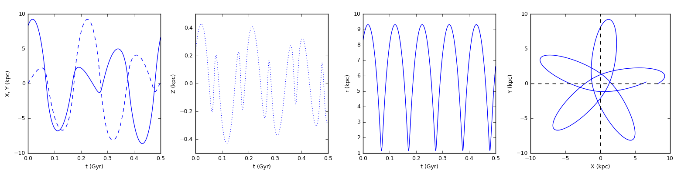

.. |Msun| replace:: *M*:sub:`⊙`
.. |kms| replace:: km s\ :sup:`−1`

Kinetics
=========

Summaries
---------

**Stellar kinetics**

.. currentmodule:: stella.kinetics.orbit
.. autosummary::
    compute_UVW
    compute_GalXYZ
    compute_Galorbit

**Galactic potentials**

.. currentmodule:: stella.kinetics.potential
.. autosummary::
    Potential
    PointPotential
    HernquistPotential
    MiyamotoNagaiPotential
    NFWPotential

Stellar orbits in the Milky Way
--------------------------------
Stellar orbits in the Milky Way can be calculated by numerially integrating the
equations of motion.
The Galactic potenial can be approximated with the sum of three components
(bulge, disk, and halo, e.g., Gnedin et al. 2005 [#Gnedin2005]_),

.. math::

   \Phi = \Phi_\mathrm{bluge} + \Phi_\mathrm{disk} + \Phi_\mathrm{halo}

or four components (including the central black hole, e.g., Kenyon et al. 2008
[#Kenyon2008]_).

.. math::

   \Phi = \Phi_\mathrm{BH} + \Phi_\mathrm{bluge} + \Phi_\mathrm{disk} + \Phi_\mathrm{halo}

Black Hole Potential
^^^^^^^^^^^^^^^^^^^^^
The potenail of the central black hole is spherically symmetric:

.. math::

    \Phi_\mathrm{BH}(r) = -\frac{GM_\mathrm{BH}}{r}

where *r* is the radial distance to the zero point in spherical coordinate
system. The mass of the central black hole Sgr A* (*M*:sub:`BH`) has been
measured in various studies, e.g.,

.. csv-table:: Mass of central black hole
    :header: "*M*:sub:`BH` (10\ :sup:`6` |Msun|)", "References"
    :widths: 20, 40

    "3.61 ± 0.32",                     "Eisenhauer et al. 2005 [#Eisenhauer2005]_"
    "4.1 ± 0.4",                       "Morris et al. 2012 [#Morris2012]_"
    "5.76 :sup:`+1.76`\ :sub:`−1.26`", "Do et al. 2013 [#Do2013]_"
    "4.0",                             "Fragione et al. 2017 [#Fragione2017]_"

Bulge Potential
^^^^^^^^^^^^^^^^
The bulge potential can be described with the spherically symmetric Hernquist model (Hernquist 1990 [#Hernquist1990]_):

.. math::

    \Phi(r) = -\frac{GM}{r+a}

where *r* is the radial distance to the zero point in spherical coordinate
system, and *a* is the scale radius. The relaion between *r* and (*R*, *z*) in
cylindrical coordinate system is *r* = (*R*:sup:`2` + *z*:sup:`2`)\ :sup:`1/2`.

The density distribution and culmulative mass are

.. math::

    \rho(r) = \frac{M}{2\pi} \frac{a}{r} \frac{1}{(r+a)^3}   \quad\quad
    M(r) = M\frac{r^2}{(r+a)^2}

and the escape velocity (*v*:sub:`e`) and circular velocity (*v*:sub:`circ`) are

.. math::
    v_\mathrm{e} = \sqrt{\frac{2GM}{r+a}}  \quad\quad
    v_\mathrm{c} = \frac{\sqrt{GMr}}{r+a}

Disk Potential
^^^^^^^^^^^^^^^

The disk potential can be described by the asymmetric Miyamoto & Nagai 1975
[#Miyamoto1975]_ model:

.. math::

    \Phi_\mathrm{disk}(R, z) = -\frac{GM_\mathrm{disk}}{\sqrt{R^2 + (a+\sqrt{z^2 + b^2})^2}}

where (*R*, *z*) is the radial distance to z-axis and the height in the galactocentric
cylindrical coordinate system, *M*:sub:`disk` is mass of disk, *a* is the scale
length and *b* is the scale height. The table below lists different parameter
adopted in various studies.

======================== ========== ========== ==============================
*M*:sub:`disk` (|Msun|)  *a* (kpc)  *b* (kpc)  References
======================== ========== ========== ==============================
5.0 × 10\ :sup:`10`      2.4         0.18      Dehnen & Binney 1998 [#Dehnen1998a]_
4.0 × 10\ :sup:`10`      5           0.3       Gnedin et al. 2005 [#Gnedin2005]_
4.0 × 10\ :sup:`10`      5           0.3       Yu & Madau 2007 [#Yu2007]_
6 × 10\ :sup:`10`        2.75        0.3       Kenyon et al. 2014 [#Kenyon2014]_
5.36 × 10\ :sup:`10`     2.75        0.3       Fragione et al. 2017 [#Fragione2017]_
======================== ========== ========== ==============================

Halo Potential
^^^^^^^^^^^^^^^
The halo potential can be described with the spherically symmetric
Navarro-Frenk-White model of dark matter (Navarro et al. 1997 [#Navarro1997]_):

.. math::

    \Phi_\mathrm{halo} (r) = -\frac{GM_\mathrm{halo}\ln\left(1+r/r_\mathrm{s}\right)}{r}

where *r* is the radial distance to the zero point in spherical coordinate
systeme, and *r*:sub:`s` is the scale radius.

Orbital Parameters
^^^^^^^^^^^^^^^^^^^

Serveral orbital parameters are defined to characterize stellar orbits in the
Milky Way (e.g. Takeda 2007 [#Takeda2007]_):

* The mean galactocentric radius *R*:sub:`mean` ≡ (*R*:sub:`max` + *R*:sub:`min`)/2;

* The ellipticity *e* ≡ (*R*:sub:`max` − *R*:sub:`min`)/(*R*:sub:`max` + *R*:sub:`min`);

* The maximum separation from the Galactic plane (*z*:sub:`max`);

* The absolute speed relative to the local standard of rest (\|\ *v*\ \|\ :sub:`LSR`);

Integration of equations of motion
^^^^^^^^^^^^^^^^^^^^^^^^^^^^^^^^^^^
To calculate the orbits in the Milky Way, parameters of the Galactic components
should be chose to match the circular velocity at the distance of the Sun. For
example, the Galactic potential is described with the four-component model:

* *Φ*:sub:`BH` - point potential with *M*:sub:`BH` = 4.3 × 10\ :sup:`6` |Msun|
  (Gillessen et al. 2009a [#Gillessen2009a]_; 2009b [#Gillessen2009b]_);
* *Φ*:sub:`bulge` - Hernquist potential with *M*:sub:`bulge` = 3.76 × 10\ :sup:`9` |Msun| and *a* = 0.1 kpc;
* *Φ*:sub:`disk` - Miyamoto & Nagai potential with *M*:sub:`disk` = 6 × 10\ :sup:`10` |Msun|,
  *a* = 2.75 kpc, and *b* = 0.3 kpc;
* *Φ*:sub:`halo` - NFW potential with *M*:sub:`halo` = 1 × 10\ :sup:`12` |Msun|
  and *r*:sub:`s` = 20 kpc;

.. code-block:: python

    from stella.kinetics import potential
    potential_lst = [potential.PointPotential(M=4.3e6),
                     potential.HernquistPotential(M=3.76e9, a=0.1),
                     potential.MiyamotoNagaiPotential(M=6e10, a=2.75, b=0.3),
                     potential.NFWPotential(M=1e12, rs=20),
                    ]

The parameters above are chosen by Kenyon et al. 2014 [#Kenyon2014]_ and
Fragione et al. 2017 [#Fragione2017]_ to match the circular rotation speed
(*Θ*:sub:`0` = 235 |kms|) at the solar distance (*R*:sub:`0`).

.. code-block:: python

    import numpy as np
    R0 = 8.34
    vcirc_lst = list(map(lambda potential: potential.v_circ(R0), potential_lst))
    # vcirc_lst = [1.489, 43.52, 160.1, 167.3]
    v0 = np.sqrt((np.array(vcirc_lst)**2).sum())
    # v0 = 235.6

.. csv-table::
    :header: "*R*:sub:`0` (kpc)", "*Θ*:sub:`0` (|kms|)", "References"
    :widths: 15, 15, 20
    
    "8.05 ± 0.45", "238 ± 14", "Honma et al. 2012 [#Honma2012]_"
    "8.27 ± 0.29", "238 ± 9",  "Schönrich 2012 [#Schonrich2012]_"
    "8.34 ± 0.16", "240 ± 8",  "Reid et al. 2014 [#Reid2014]_"

Calculate the orbit of the Sun

.. code-block:: python

    solar_uvw = (9.6, 255.2, 9.3) # from Reid et al. 2014
    t_lst = np.arange(0, 0.4, 0.0001) # in Gyr

    x_lst, y_lst, z_lst = orbit.compute_Galorbit(
                            potential = potential_lst,
                            xyz=(R0,0.,0.),
                            uvw=(0.,0.,0.),
                            solar_uvw=solar_uvw,
                            t=t_lst)

Calculate the orbit of `HD 122563
<http://simbad.u-strasbg.fr/simbad/sim-id?Ident=HD+122563>`_ (HIP 68594)

    

.. code-block:: python

    from stella.catalog  import find_catalog
    hip = 68594
    item = find_catalog.find_HIP2(hip)
    ra, dec = item['RAdeg'], item['DEdeg']
    rv = (-26.58, 0.15) # from SIMBAD
    parallax = (item['Plx'], item['e_Plx'])
    pm = ((item['pmRA'], item['e_pmRA']),(item['pmDE'], item['e_pmDE']))
    uvw = orbit.compute_UVW(ra=ra,dec=dec,rv=rv,parallax=parallax,pm=pm,U_plus='center')
    xyz = orbit.compute_GalXYZ(ra=ra,dec=dec,parallax=parallax,R0=R0)
    x1_lst, y1_lst, z1_lst = orbit.compute_Galorbit(
                                potential = potential_lst,
                                xyz=xyz,
                                uvw=uvw,
                                solar_uvw=solar_uvw,
                                t=t_lst)

References
------------
.. [#Dehnen1998a] Dehnen & Binney, 1998, *MNRAS*, 294, 429 :ads:`1998MNRAS.294..429D`
.. [#Do2013] Do et al., 2013, *ApJ*, 779, L6 :ads:`2013ApJ...779L...6D`
.. [#Eisenhauer2005] Eisenhauer et al., 2005, *ApJ*, 628, 246 :ads:`2005ApJ...628..246E`
.. [#Fragione2017] Fragione et al., 2017, *MNRAS*, 467, 451 :ads:`2017MNRAS.467..451F`
.. [#Gillessen2009a] Gillessen et al., 2009a, *ApJ*, 707, L114 :ads:`2009ApJ...707L.114G`
.. [#Gillessen2009b] Gillessen et al., 2009b, *ApJ*, 692, 1075 :ads:`2009ApJ...692.1075G`
.. [#Gnedin2005] Gnedin et al., 2005, *ApJ*, 634, 344 :ads:`2005ApJ...634..344G`
.. [#Hernquist1990] Hernquist, 1990, *ApJ*, 356, 359 :ads:`1990ApJ...356..359H`
.. [#Honma2012] Honma et al., 2012, *PASJ*, 64, 136 :ads:`2012PASJ...64..136H`
.. [#Kenyon2008] Kenyon et al., 2008, *ApJ*, 680, 312 :ads:`2008ApJ...680..312K`
.. [#Kenyon2014] Kenyon et al., 2014, *ApJ*, 793, 122 :ads:`2014ApJ...793..122K`
.. [#Miyamoto1975] Miyamoto & Nagai, 1975, *PASJ*, 27, 533 :ads:`1975PASJ...27..533M`
.. [#Morris2012] Morris et al., 2012, *RAA*, 12, 995 :ads:`2012RAA....12..995M`
.. [#Navarro1997] Navarro et al., 1997, *ApJ*, 490, 493 :ads:`1997ApJ...490..493N`
.. [#Reid2014] Reid et al., 2014, *ApJ*, 783, 130 :ads:`2014ApJ...783..130R`
.. [#Schonrich2012] Schönrich, 2012, *MNRAS*, 427, 274 :ads:`2012MNRAS.427..274S`
.. [#Takeda2007] Takeda, 2007, *PASJ*, 59, 335 :ads:`2007PASJ...59..335T`
.. [#Yu2007] Yu & Madau, 2007, *MNRAS*, 379, 1293 :ads:`2007MNRAS.379.1293Y`
