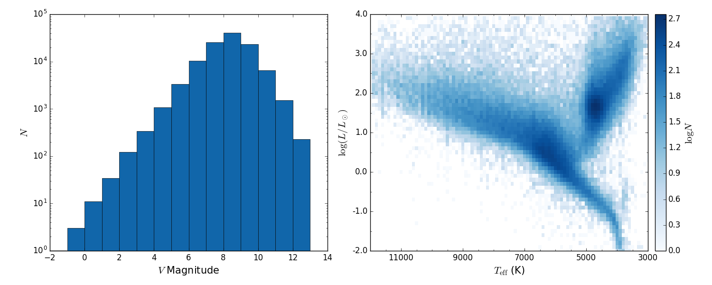
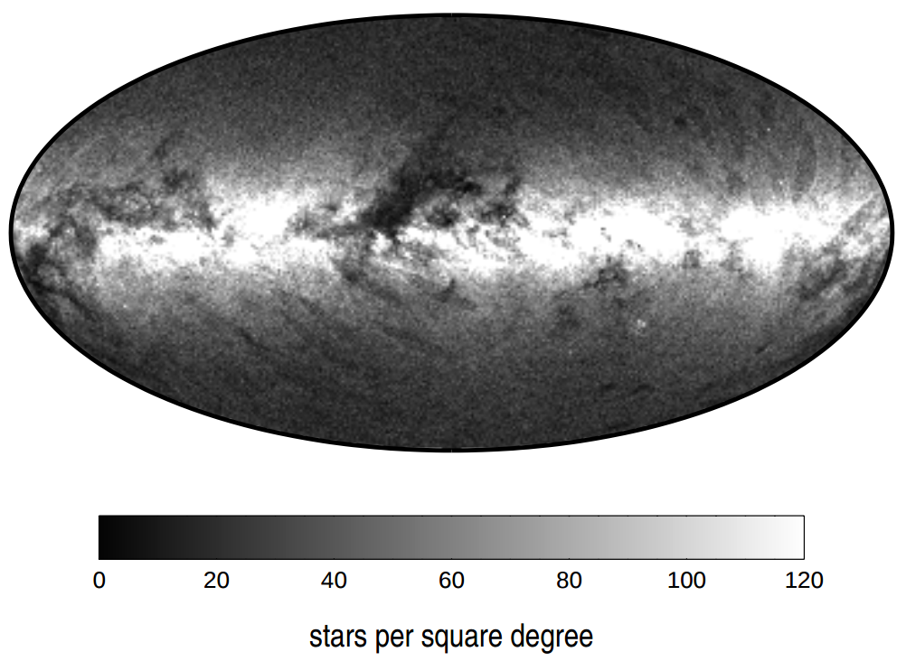
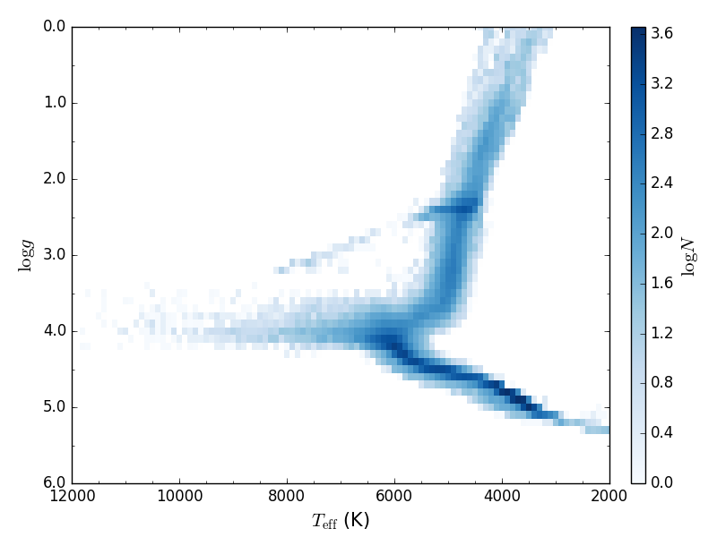

.. |Teff| replace:: *T*:sub:`eff`

Catalogues
==========

Summaries
---------

**Star name parsing functions (name module)**

.. currentmodule:: stella.catalog.name

.. autosummary::
    get_catalog
    get_regular_name

**Cross index functions (xindex module)**

.. currentmodule:: stella.catalog.xindex

.. autosummary::

.. _catalog_hip:

Hipparcos Catalogue (HIP)
--------------------------
The Hipparcos Catalogue (`I/239
<http://vizier.u-strasbg.fr/viz-bin/VizieR-3?-source=I/239>`_, Perryman et al.
1997 [#Perryman1997]_) is the product of the *Hipparcos* satellite of the
European Space Agency (ESA).
During its four years of operation from Novermber 1989 to March 1993, the
satellite measured accurate triangular parallaxes and proper motions for a large
number of stars.
The limiting magnitude is *V* ~ 12.4, and the *V* magnitude completeness is 7.3
~ 9.0, depending on the galactic latitude and spectral type.
The median error in parallax is 0.97 mas for stars with *Hipparcos* magnitudes
brighter than 9.
The published astrometric solutions are given in International Celestial
Reference System (ICRS) at epoch J1991.25.

.. _catalog_hip2:

van Leeuwen 2007 [#vanLeeuwen2007]_ presents the new reduction of *Hipparcos*
astrometric data (`I/311
<http://vizier.u-strasbg.fr/viz-bin/VizieR-3?-source=I/311>`_).

    
    Histogram of *V* magnitudes (*left*) and H-R diagram (*right*)

.. currentmodule:: stella.catalog
.. autosummary::
    hip._HIP.find_object
    hip._HIP2.find_object
    base._get_HIP_number

.. _catalog_tyc2:

Tycho-2 Catalogue (TYC-2)
-------------------------
The Tycho-2 Catalogue (`I/259
<http://vizier.u-strasbg.fr/viz-bin/VizieR-3?-source=I/259>`_, Høg et al. 2000
[#Hog2000]_) contains atrometric and two-colour photometric reference data for
2.5 million brightest stars on the entire sky.
It is based on the observational data collected by the ESA *Hipparcos*
satellite.
Proper motions are givenfor 96% of the stars based on the observed positions
in Tycho-2, the Astrographic Catalogue (AC) and 143 other ground-based
catalogues.
The uncertainty on proper motion is 2.5 mas/yr.
Supplement-1 lists stars included the Hipparcos and Tycho-1 Catalogues but not
in TYC-2, and Supplement-2 lists 1146 Tycho-1 sstars which are probably either
false or heavily disturbed.

The table below lists the number of stars and precision of Tycho-2 within the
given intervals of *V*:sub:`T` magnitude (from Table 2 of Høg et al. 2000).

.. csv-table::
   :header: Interval of *V*:sub:`T`, < 7.0, 7 ~ 8.0, 8 ~ 9.0, 9 ~ 10.0, 10 ~ 11.0, 11 ~ 12.0, > 12.0, All, < 9.0
   :widths: 35, 10, 10, 10, 10, 10, 10, 10, 10, 10

    Median *V*:sub:`T`,                             6.39,     7.63,     8.62,     9.61,      10.61,     11.54,       12.28,     11.41,       8.34
    *N* (positions),                                "14,145", "27,770", "78,296", "207,569", "536,565", "1,127,627", "547,935", "2,539,913", "120,211"
    *N*:sub:`Suppl-1`,                              109,      49,       202,      "1,218",   "6,768",   "7,482",     "1,733",   "17,588",    360
    *N* (proper motions),                           "13,773", "27,684", "78,146", "207,125", "533,549", "1,069,268", "500,918", "2,430,468", "119,603"
    Mean epoch of positions,                        1991.37,  1991.23,  1990.75,  1989.25,   1986.89,   1982.67,     1978.21,   1984.34,     1990.99
    Median errors in Tycho positions (mas),         3.8,      5.0,      7.9,      15.9,      35.4,      71.3,        103.5,     64.0,        6.6
    Median errors in positions at mean epoch (mas), 4.0,      5.0,      8.0,      15.0,      30.0,      63.0,        92.0,      55.0,        7.0
    Median errors in proper motions (mas/yr),       1.0,      1.2,      1.3,      1.5,       2.0,       2.5,         3.0,       2.4,         1.2    
    Median errors in *B*:sub:`T` magnitudes,        0.015,    0.016,    0.020,    0.033,     0.068,     0.173,       0.248,     0.143,       0.018
    Median errors in *V*:sub:`T` magnitudes,        0.010,    0.011,    0.014,    0.023,     0.050,     0.114,       0.198,     0.100,       0.013

    Stellar densities in Tycho-2 Catalogue in galactic coordinates. From Figure
    1 of Høg et al. 2000

.. currentmodule:: stella.catalog
.. autosummary::
    tyc2._TYC2.find_object

.. _catalog_kic:

Kepler Input Catalog (KIC)
---------------------------
The Kepler Input Catalog (`V/133
<http://vizier.u-strasbg.fr/viz-bin/VizieR-3?-source=V/133>`_, Kepler Mission
Team, 2009) contains photometric and physical data of over 13 million objects in
the *Kepler* field of view.
The photometric observations were taken with the 1.2m reflector at the Fred
Lawrence Whipple Observatory.
Seven bands were used, including the SDSS *u*, *g*, *r*, *i*, *z* filters,
*G*:sub:`red` band centered at 432 nm, and *D*\ 51 band centered at 510 nm.
But two of them (*u* and *D*\ 51) are available only for a small subset of the
data.
The magnitudes in SDSS bands were calibrated using 284 standard stars in common
with SDSS DR1.
The *Kepler* magnitudes as defined by the *Kepler* response curve centered at
665 nm were computed by linear combinations of *g*, *r*, *i* magnitudes.
The stellar physical parameters (|Teff|, log\ *g*, log\ *Z* and
*E*:sub:`B−V`) were estimated using Bayesian method to match the observed colors
to the Castelli & Kurucz 2004 [#Castelli2004]_ stellar atmosphere models.
For details, see Brown et al. 2011 [#Brown2011]_.

There are some known biases on the physical parameters in the Kepler Input
Catalog.
We refer the readers to Pinsonneault et al. 2012 [#Pinsonneault2012]_ for an
improved |Teff| scale and Dong et al. 2014 [#Dong2014]_ for an improved
[Fe/H] scale.
Besides, Huber et al. 2014 [#Huber2014]_ derived parameters for 196,468 stars
using Kepler photometric data, including 11,532 unclassified targes in this
catalogue.

.. figure:: images/2010ApJ...713L..79K.Fig1.png
    :alt: Kepler response curves
    :align: center
    :width: 500px
    :figwidth: 500px

    Response curves of the *Kepler* telescope. From Koch et al. 2010
    [#Koch2010]_

.. figure:: examples/catalog_KIC/histogram.png
    :alt: KIC statistics
    :align: center
    :width: 900px
    :figwidth: 900px
    
    Histogram of *K*:sub:`p` magnitudes (*left*) and |Teff| - log\ *g*
    diagram (*right*)

.. currentmodule:: stella.catalog
.. autosummary::
    kic._KIC.find_object
    base._get_KIC_number

.. _catalog_epic:

K2 Ecliptic Plane Input Catalog (EPIC)
--------------------------------------
The *K2* Ecliptic Plane Input Catalog (EPIC, Huber et al. 2016 [#Huber2016]_)
provides photometry, kinematics, and stellar parameters to support target
selection for the *K2* mission (Howell et al. 2014 [#Howell2014]_).
There are 138,600 targets in *K2* Campaigns 1-8, including K-M dwarfs (~41%),
F-G dwarfs (~36%), and K giants (~21%).

    2D histogram of EPIC stars on *T*:sub:`eff` − log\ *g* plane.

.. currentmodule:: stella.catalog
.. autosummary::
    epic._EPIC.find_object
    base._get_EPIC_number

References
------------
.. [#Brown2011] Brown et al., 2011, *AJ*, 142, 112 :ads:`2011AJ....142..112B`
.. [#Castelli2004] Castelli & Kurucz, 2004, arXiv: astrop-h/0405087 :arXiv:`astro-ph/0405087`
.. [#Dong2014] Dong et al., 2014, *ApJ*, 789, L3 :ads:`2014ApJ...789L...3D`
.. [#Hog2000] Høg et al., 2000, *A&A*, 355, L27 :ads:`2000A%26A...355L..27H`
.. [#Howell2014] Howell et al., 2014, *PASP*, 126, 398 :ads:`2014PASP..126..398H`
.. [#Huber2014] Huber et al., 2014, *ApJS*, 211, 2 :ads:`2014ApJS..211....2H`
.. [#Huber2016] Huber et al., 2016, *ApJS*, 224, 2 :ads:`2016ApJS..224....2H`
.. [#Koch2010] Koch et al., 2010, *ApJ*, 713, L79 :ads:`2010ApJ...713L..79K`
.. [#Perryman1997] Perryman et al., 1997, *A&A*, 323, L49 :ads:`1997A%26A...323L..49P`
.. [#Pinsonneault2012] Pinsonneault et al., 2012, *ApJS*, 199, 30 :ads:`2012ApJS..199...30P`
.. [#vanLeeuwen2007] van Leeuwen, 2007, *A&A*, 474, 653 :ads:`2007A%26A...474..653V`
