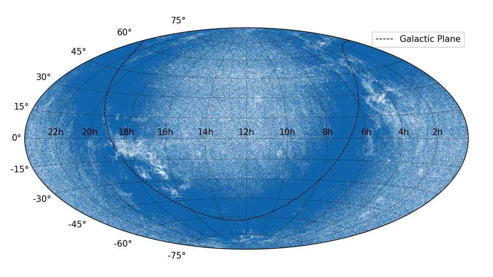
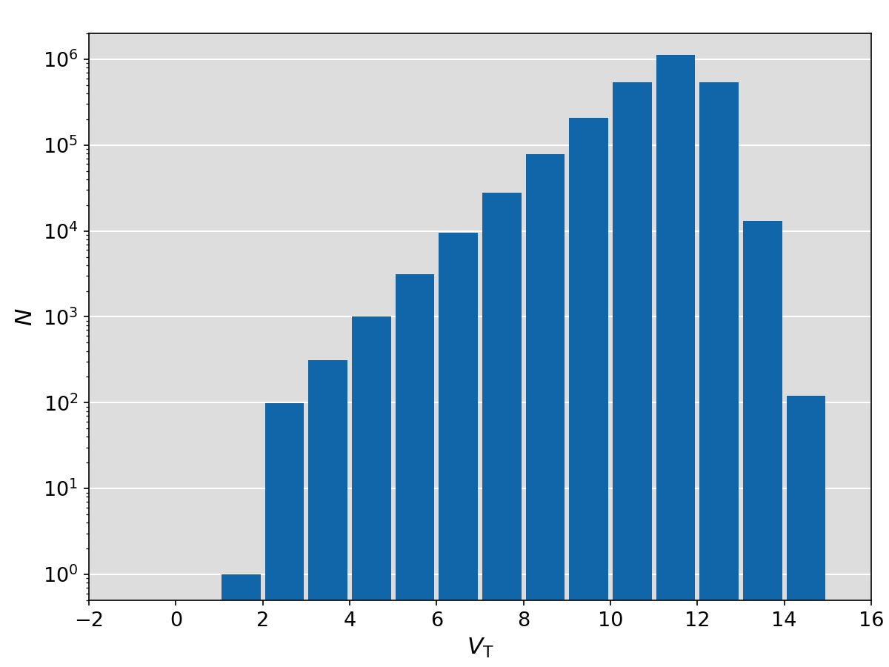

.. |Teff| replace:: *T*:sub:`eff`

Catalogues
==========

Summaries
---------

**Star name parsing functions (name module)**

.. currentmodule:: stella.catalog.name

.. autosummary::
    get_catalog
    get_regular_name

**Cross index functions (xindex module)**

.. currentmodule:: stella.catalog.xindex

.. autosummary::

.. _catalog_hip:

Hipparcos Catalogue (HIP)
--------------------------
The *Hipparcos Catalogue* (`I/239
<http://vizier.u-strasbg.fr/viz-bin/VizieR-3?-source=I/239>`_, Perryman et al.
1997 [#Perryman1997]_) is the product of the *Hipparcos* satellite of the
European Space Agency (ESA).
During its four years of operation from Novermber 1989 to March 1993, the
satellite measured accurate triangular parallaxes and proper motions for a large
number of stars.
The limiting magnitude is *V* ~ 12.4, and the *V* magnitude completeness is 7.3
~ 9.0, depending on the galactic latitude and spectral type.
The median error in parallax is 0.97 mas for stars with *Hipparcos* magnitudes
brighter than 9.
The published astrometric solutions are given in International Celestial
Reference System (ICRS) at epoch J1991.25.
Below are the skymap, *V* magnitude histogram, and 2D HRD histogram of the
*Hipparcos Catalogue*.

.. image:: examples/catalog_HIP/skymap_hip.png
    :alt: Skymap of HIP 
    :height: 270px

.. image:: examples/catalog_HIP/hrdhist_hip.png
    :alt: Magnitude histogram of HIP
    :height: 270px
   
   
.. _catalog_hip2:

van Leeuwen 2007 [#vanLeeuwen2007]_ presents the new reduction (`I/311
<http://vizier.u-strasbg.fr/viz-bin/VizieR-3?-source=I/311>`_) of *Hipparcos*
astrometric data.
A comparison of parallaxes between HIP (I/239, Perryman 1997) and HIP New
Reduction (I/311, van Leeuwen 2007) is shown below.

    Comparison of parallaxes between HIP and HIP2.

.. currentmodule:: stella.catalog
.. autosummary::
    hip._HIP
    hip._HIP.find_object
    hip._HIP2
    hip._HIP2.find_object
    name._get_HIP_number

.. _catalog_tyc2:

Tycho Catalogues (TYC)
----------------------
The *Tycho Catalogue* (`I/239/tyc_main
<http://vizier.u-strasbg.fr/viz-bin/VizieR-3?-source=I/239/tyc_main>`_, ESA
1997) contains astrometric and two-colour photometric data for 1.06 million
stars.
It is based on the observational data collected by the ESA *Hipparcos*
satellite.
The right ascensions and declinations are given in the epoch of J1991.25 in
the ICRS reference system.

Based on an advanced reduction technique, Høg et al. 2000 [#Hog2000]_ presents
the *Tycho-2 Catalogue* (`I/259
<http://vizier.u-strasbg.fr/viz-bin/VizieR-3?-source=I/259>`_) containing 2.5
million stars.
The right ascensions and declinations are transferred to the epoch of J2000.0
in the ICRS reference system.
Proper motions are given for 96% of the stars based on the observed positions
in Tycho-2, the Astrographic Catalogue (AC) and 143 other ground-based
catalogues.
The typical uncertainty on proper motion is ~2.5 mas/yr.
Supplement-1 lists stars included the Hipparcos and Tycho-1 Catalogues but not
in TYC-2, and Supplement-2 lists 1146 Tycho-1 sstars which are probably either
false or heavily disturbed.

The table below lists the number of stars and precision of Tycho-2 within the
given intervals of *V*:sub:`T` magnitude (from Table 2 of Høg et al. 2000).

.. csv-table::
   :header: Interval of *V*:sub:`T`, < 7.0, 7 ~ 8.0, 8 ~ 9.0, 9 ~ 10.0, 10 ~ 11.0, 11 ~ 12.0, > 12.0, All, < 9.0
   :widths: 35, 10, 10, 10, 10, 10, 10, 10, 10, 10

    Median *V*:sub:`T`,                             6.39,     7.63,     8.62,     9.61,      10.61,     11.54,       12.28,     11.41,       8.34
    *N* (positions),                                "14,145", "27,770", "78,296", "207,569", "536,565", "1,127,627", "547,935", "2,539,913", "120,211"
    *N*:sub:`Suppl-1`,                              109,      49,       202,      "1,218",   "6,768",   "7,482",     "1,733",   "17,588",    360
    *N* (proper motions),                           "13,773", "27,684", "78,146", "207,125", "533,549", "1,069,268", "500,918", "2,430,468", "119,603"
    Mean epoch of positions,                        1991.37,  1991.23,  1990.75,  1989.25,   1986.89,   1982.67,     1978.21,   1984.34,     1990.99
    Median errors in Tycho positions (mas),         3.8,      5.0,      7.9,      15.9,      35.4,      71.3,        103.5,     64.0,        6.6
    Median errors in positions at mean epoch (mas), 4.0,      5.0,      8.0,      15.0,      30.0,      63.0,        92.0,      55.0,        7.0
    Median errors in proper motions (mas/yr),       1.0,      1.2,      1.3,      1.5,       2.0,       2.5,         3.0,       2.4,         1.2    
    Median errors in *B*:sub:`T` magnitudes,        0.015,    0.016,    0.020,    0.033,     0.068,     0.173,       0.248,     0.143,       0.018
    Median errors in *V*:sub:`T` magnitudes,        0.010,    0.011,    0.014,    0.023,     0.050,     0.114,       0.198,     0.100,       0.013

Skymap and *V*:sub:`T` magnitude histogram of *Tycho-2 Catalogue*.

.. currentmodule:: stella.catalog
.. autosummary::
    tyc._TYC
    tyc._TYC.find_object
    tyc._TYC2
    tyc._TYC2.find_object

.. _catalog_kic:

Kepler Input Catalog (KIC)
--------------------------
The Kepler Input Catalog (`V/133
<http://vizier.u-strasbg.fr/viz-bin/VizieR-3?-source=V/133>`_, Kepler Mission
Team, 2009) contains photometric and physical data of over 13 million objects in
the *Kepler* field of view.
The photometric observations were taken with the 1.2m reflector at the Fred
Lawrence Whipple Observatory.
Seven bands were used, including the SDSS *u*, *g*, *r*, *i*, *z* filters,
*G*:sub:`red` band centered at 432 nm, and *D*\ 51 band centered at 510 nm.
But two of them (*u* and *D*\ 51) are available only for a small subset of the
data.
The magnitudes in SDSS bands were calibrated using 284 standard stars in common
with SDSS DR1, but may affected by zero-point shifts.
Pinsonneault et al. 2012 [#Pinsonneault2012]_ gave new calibration relations
for *griz* photometry in KIC based on SDSS DR8 (Aihara et al. 2011
[#Aihara2011]_).
The *Kepler* magnitudes (*K*:sub:`p`) as defined by the *Kepler* response curve
centered at 665 nm were computed by linear combinations of *g*, *r*, and *i*
magnitudes.
The stellar physical parameters (|Teff|, log\ *g*, log\ *Z* and
*E*:sub:`B−V`) were estimated using Bayesian method to match the observed colors
to the Castelli & Kurucz 2004 [#Castelli2004]_ stellar atmosphere models.
For details, see Brown et al. 2011 [#Brown2011]_.

There are some known biases on the physical parameters in the Kepler Input
Catalog.
For instance, Pinsonneault et al. 2012 [#Pinsonneault2012]_ found that KIC
underestimated |Teff| by up tp 200 K for field dwarfs.
Verner et al. 2011 [#Verner2011]_ found that the surface gravities (log\ *g*) in
KIC are overestimated by ~0.23 dex and stellar radii are underestimated by up to
50% for solar-type stars based on asteroseismic analysis.
Dong et al. 2014 [#Dong2014]_ found systematic offset on KIC metallicities.
Besides, Huber et al. 2014 [#Huber2014]_ derived properties for 196,468 stars
observed in Q1-Q16 using a variety of methods, and later updated their catalog
for Q1-Q17 transit detection run (DR24).
Mathur et al. 2017 [#Mathur2017]_ presented revised stellar properties for
197,096 Kepler targets based on Q1-Q17 data (DR25).

.. figure:: images/2010ApJ...713L..79K.Fig1.png
    :alt: Kepler response curves
    :align: center
    :width: 500px
    :figwidth: 500px

    Response curves of the *Kepler* telescope. From Koch et al. 2010
    [#Koch2010]_

.. figure:: examples/catalog_KIC/histogram.png
    :alt: KIC statistics
    :align: center
    :width: 900px
    :figwidth: 900px
    
    Histogram of *K*:sub:`p` magnitudes (*left*) and |Teff| - log\ *g*
    diagram (*right*)

.. currentmodule:: stella.catalog
.. autosummary::
    kic._KIC.find_object
    name._get_KIC_number

.. _catalog_epic:

K2 Ecliptic Plane Input Catalog (EPIC)
--------------------------------------
The *K2* Ecliptic Plane Input Catalog (`EPIC
<https://archive.stsci.edu/missions/k2/catalogs/>`_) provides photometry,
kinematics, and stellar parameters to support target selection for the *K2*
mission (Howell et al. 2014 [#Howell2014]_).
The stellar parameters are derived with the method described in Huber et al.
2016 [#Huber2016]_.
The latest version of EPIC updated in Dec. 19, 2017 contains 50,546,248 sources.

.. figure:: examples/catalog_EPIC/skymap_epic.png
    :alt: Skymap of EPIC
    :align: center
    :width: 500px
    :figwidth: 500px

    Skymap of EPIC sources

.. figure:: examples/catalog_EPIC/maghist_epic.png
    :alt: Magnitude histogram of EPIC
    :align: center
    :width: 500px
    :figwidth: 500px

    *K*:sub:`p` magnitude histogram of EPIC sources

.. figure:: examples/catalog_EPIC/kielhist_epic.png
    :alt: EPIC Kiel
    :align: center
    :width: 500px
    :figwidth: 500px

    Kiel diagram of EPIC stars

.. currentmodule:: stella.catalog
.. autosummary::
    epic._EPIC.find_object
    name._get_EPIC_number

References
----------
.. [#Aihara2011] Aihara et al., 2011, *ApJS*, 193, 29 :ads:`2011ApJS..193...29A`.
.. [#Brown2011] Brown et al., 2011, *AJ*, 142, 112 :ads:`2011AJ....142..112B`
.. [#Castelli2004] Castelli & Kurucz, 2004, arXiv: astrop-h/0405087 :arXiv:`astro-ph/0405087`
.. [#Dong2014] Dong et al., 2014, *ApJ*, 789, L3 :ads:`2014ApJ...789L...3D`
.. [#Hog2000] Høg et al., 2000, *A&A*, 355, L27 :ads:`2000A%26A...355L..27H`
.. [#Howell2014] Howell et al., 2014, *PASP*, 126, 398 :ads:`2014PASP..126..398H`
.. [#Huber2014] Huber et al., 2014, *ApJS*, 211, 2 :ads:`2014ApJS..211....2H`
.. [#Huber2016] Huber et al., 2016, *ApJS*, 224, 2 :ads:`2016ApJS..224....2H`
.. [#Koch2010] Koch et al., 2010, *ApJ*, 713, L79 :ads:`2010ApJ...713L..79K`
.. [#Mathur2017] Mathur et al., 2017, *ApJS*, 229, 30 :ads:`2017ApJS..229...30M`
.. [#Perryman1997] Perryman et al., 1997, *A&A*, 323, L49 :ads:`1997A%26A...323L..49P`
.. [#Pinsonneault2012] Pinsonneault et al., 2012, *ApJS*, 199, 30 :ads:`2012ApJS..199...30P`
.. [#vanLeeuwen2007] van Leeuwen, 2007, *A&A*, 474, 653 :ads:`2007A%26A...474..653V`
.. [#Verner2011] Verner et al., 2011, *ApJ*, 738, L28 :ads:`2011ApJ...738L..28V`
