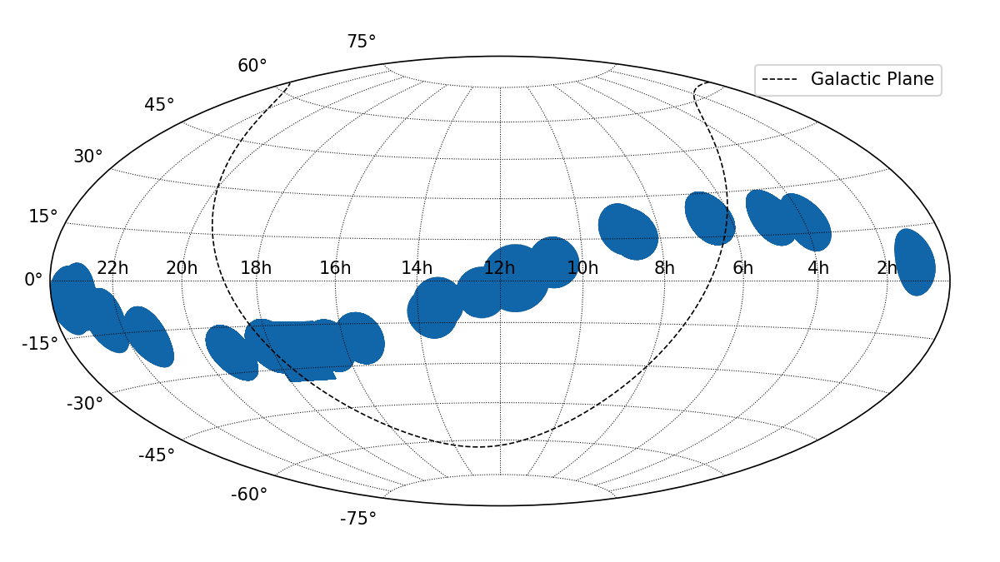
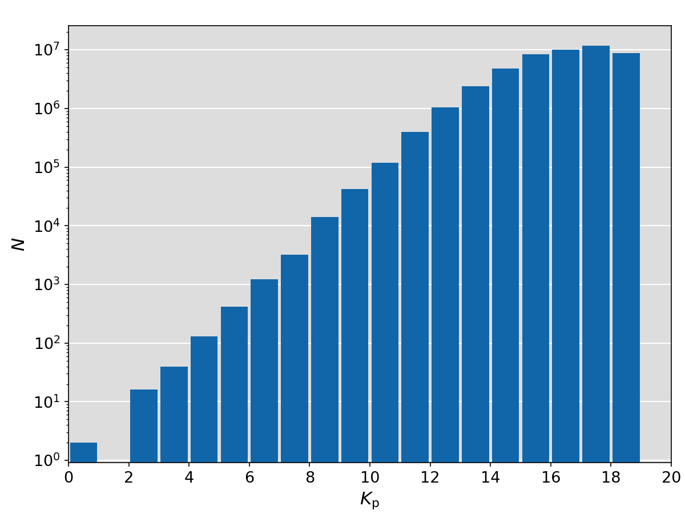
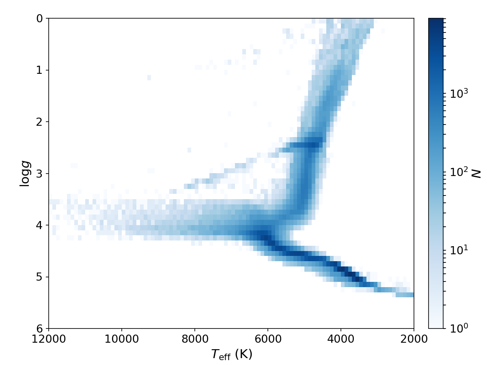

K2 Ecliptic Plane Input catalog (EPIC)
======================================

Convert ASCII file into FITS table
----------------------------------

.. literalinclude:: convert.py
   :language: python

Skymap, Magnitude Histograms, and Kiel Diagram of EPIC
------------------------------------------------------

.. literalinclude:: plot.py
   :language: python

