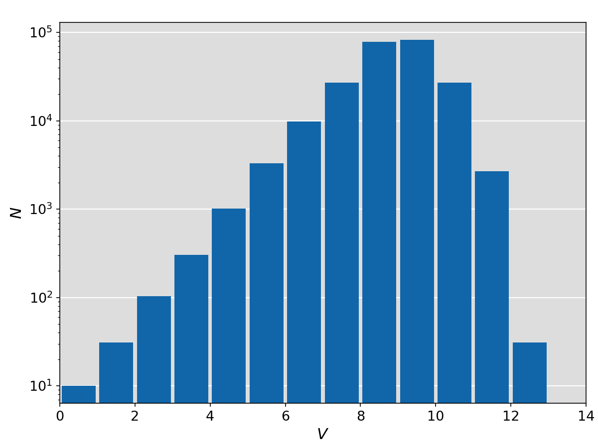

Henry Draper Catalogue
======================

Convert ASCII to FITS Table
---------------------------
Below example converts the ASCII files of HIP to FITS file.

.. literalinclude:: convert.py
   :language: python

Skymap and Magnitude Distributions
----------------------------------

.. literalinclude:: plot.py
   :language: python

