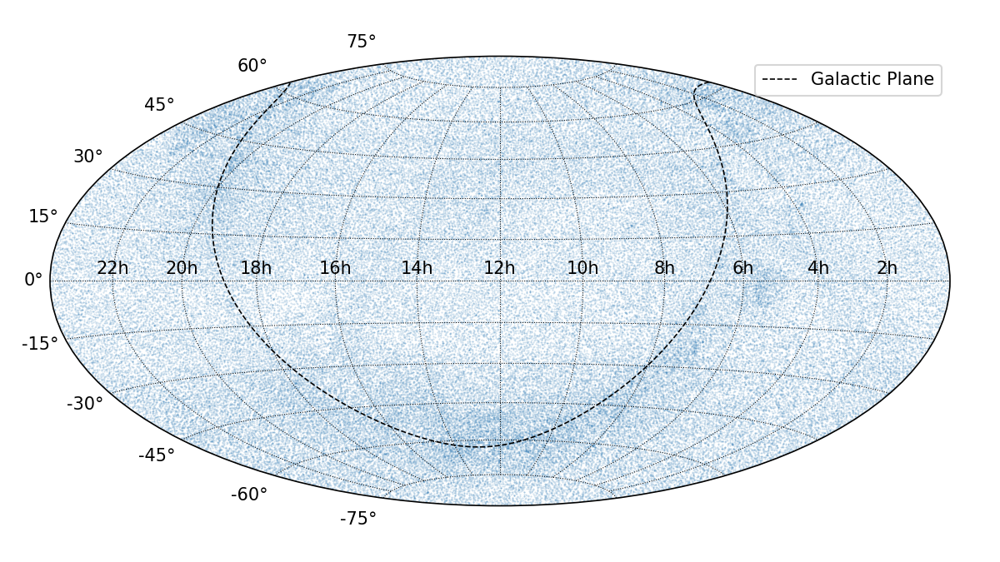
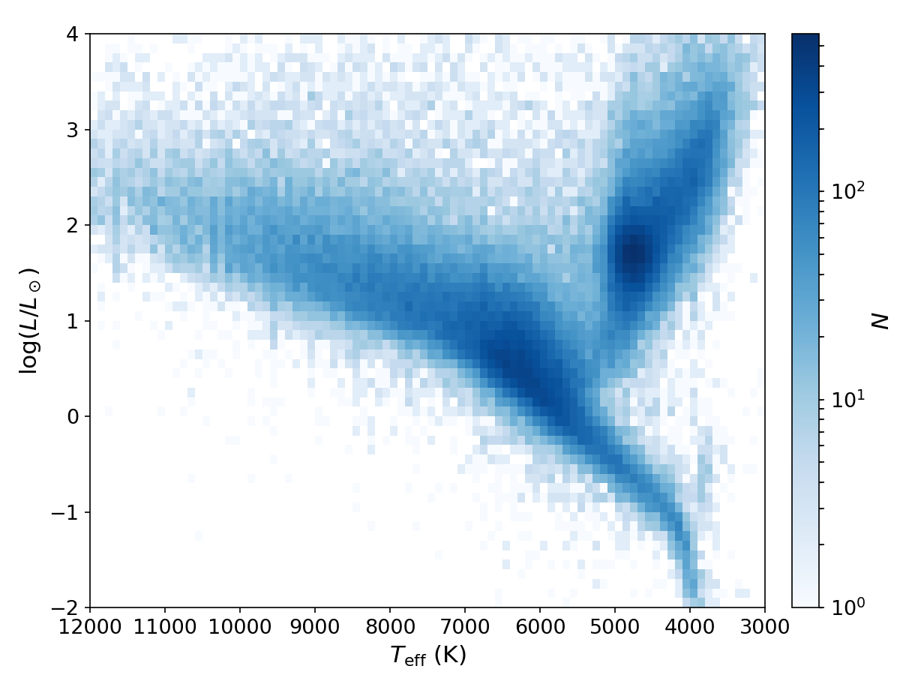

Hipparcos Catalogue
===================

Convert ASCII to FITS Table
---------------------------
Below example converts the ASCII files of HIP to FITS file.

.. literalinclude:: convert_HIP.py
   :language: python

And below example converts the ASCII files of HIP (New Reduction) to FITS file.

.. literalinclude:: convert_HIP2.py
   :language: python

Skymap, Magnitudes, and HRD
----------------------------
Below example plots the skymap, histogram of *V* magnitudes, and HRD of HIP
stars.

.. literalinclude:: plot.py
   :language: python

.. image:: maghist_hip.png
    :alt: Magnitude histogram of HIP
    :height: 270px

Uncertainties on Parallax
-------------------------
Below exmple shows the relative uncertainty on parallax as functions of
parallax, distance, and *H*:sub:`p` magnitude.

.. literalinclude:: plot_error.py
   :language: python

    Relative uncertainties on parallax for HIP (Perrymann+ 1997).

    Relative uncertainties on parallax for HIP2 (van Leeuwen 2007).

Comaprison of HIP and HIP2
--------------------------
Below example shows the comparison of parallaxes between HIP and HIP2.
The whole sample is divided into two subgroups, with average parallaxes larger
than 5 mas (*green*), and smaller than 5 mas (*red*).
Relative uncertainties are compared in the middle and right panels.

.. literalinclude:: compare_parallax.py
   :language: python

.. figure:: compare_parallax.png
    :alt: comparison of parallaxes between HIP and HIP2
    :align: center
    :width: 900px
    :figwidth: 900px

    Comparison of parallaxes between HIP and HIP2.
