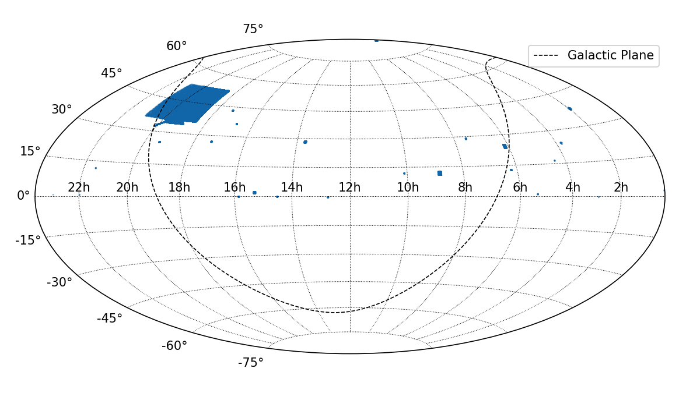

.. |Teff| replace:: *T*:sub:`eff`

Kepler Input Catalog
====================

Convert ASCII Files to FITS Table
---------------------------------
Below example converts the ASCII files of KIC to FITS file.

.. literalinclude:: convert.py
   :language: python

Skymap, Magnitudes, and Kiel diagram
------------------------------------
Below example plots the skymap, histogram of *K*:sub:`p` magnitudes, and Kiel
diagram of KIC.

.. literalinclude:: plot.py
   :language: python

Counting Parameters
-------------------
Below example read the ASCII files of KIC, and counts the number of parallax,
proper motion, and atmospheric parameters in KIC.

.. literalinclude:: count_parameters.py
   :language: python

Results::

    N(PM)=12944973, N(Plx)=958, N(para)=2106821
