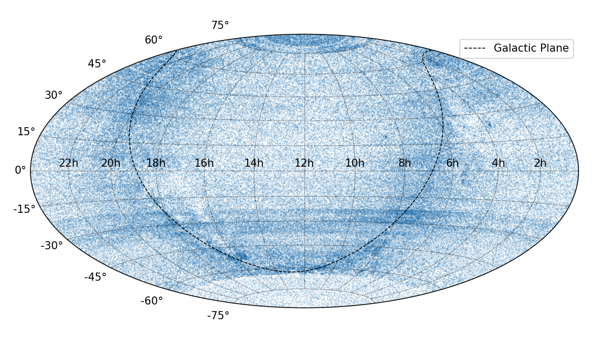
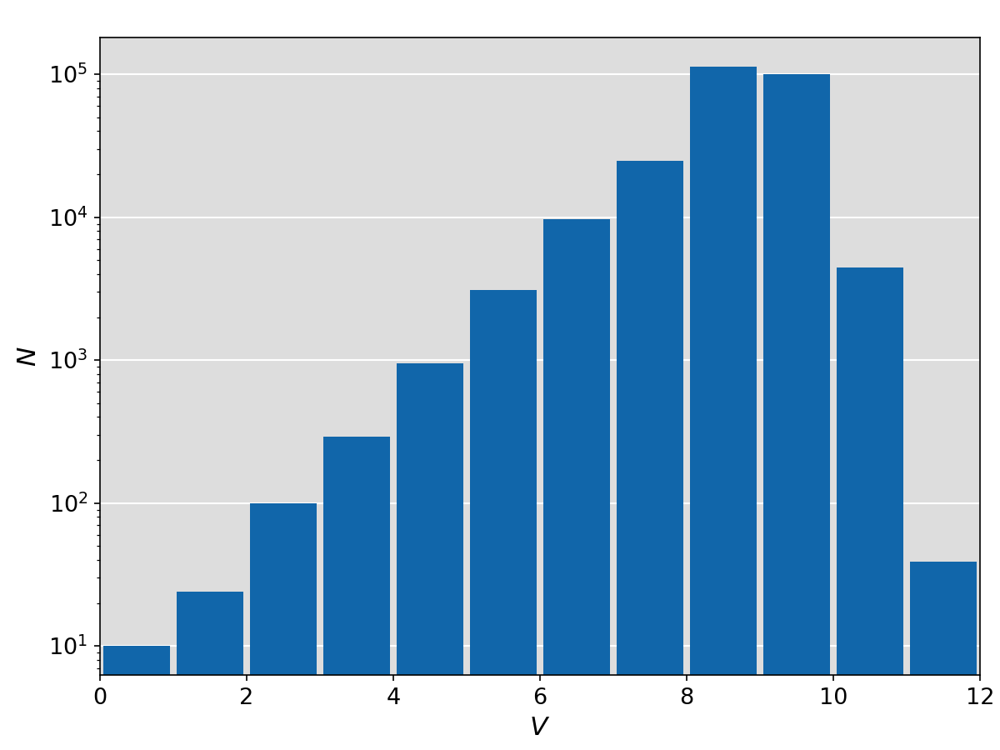

SAO catalogue
=============

Convert ASCII to FITS Table
---------------------------
Below example converts the ASCII files of SAO to FITS file.

.. literalinclude:: convert.py
   :language: python

Skymap and Magnitudes Histogram
--------------------------------
Below example plots the skymap, histogram of *V* magnitudes of SAO stars.

.. literalinclude:: plot.py
   :language: python

