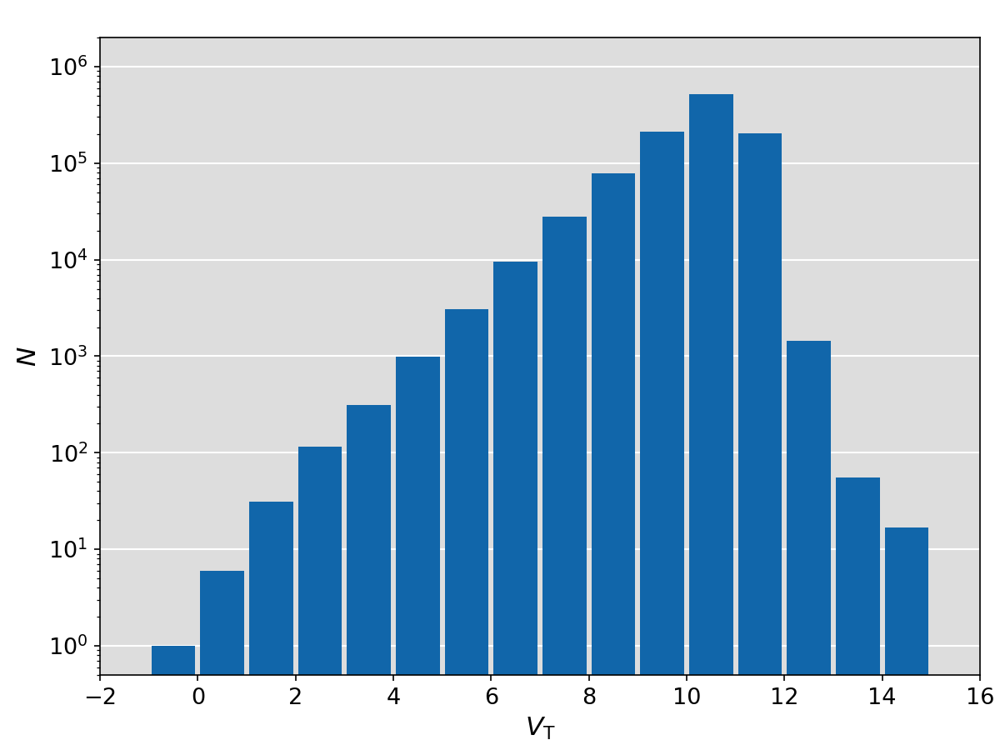

Tycho Catalogue
===============

Convert ASCII files to FITS table
---------------------------------

Convert the ASCII table of *Tycho Catalogue* into FITS file:

.. literalinclude:: convert_TYC.py
   :language: python

Convert the ASCII table of *Tycho-2 Catalogue* into FITS file:

.. literalinclude:: convert_TYC2.py
   :language: python

Skymaps and Magnitude Histograms
--------------------------------

.. literalinclude:: plot.py
   :language: python

*Tycho Catalogue*:

*Tycho-2 Catalogue*:

.. image:: skymap_tyc2.png
    :alt: Skymap of Tycho-2
    :height: 350px
.. image:: maghist_tyc2.png
    :alt: Magnitude histogram of Tycho-2
    :height: 350px
