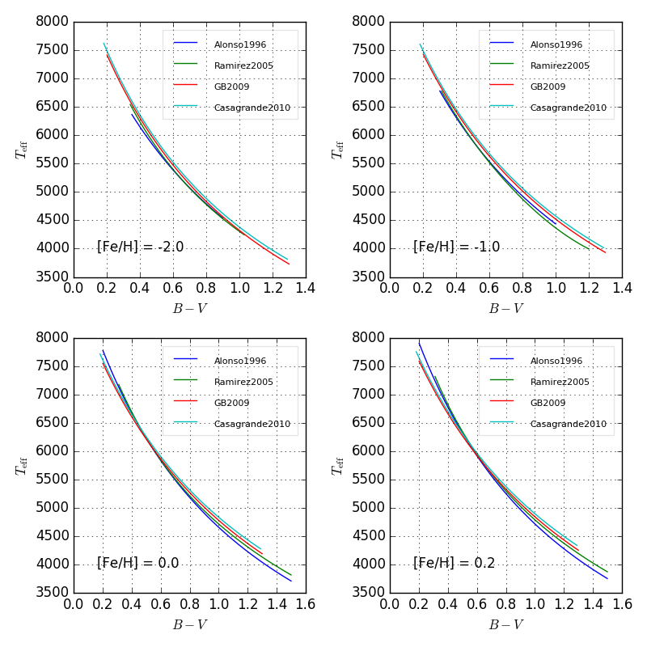

Comparison of Color - *T*:sub:`eff` Calibration Relations
=========================================================

(*B* − *V*) v.s. *T*:sub:`eff` Relations
----------------------------------------

.. literalinclude:: compare_BV.py
   :language: python
