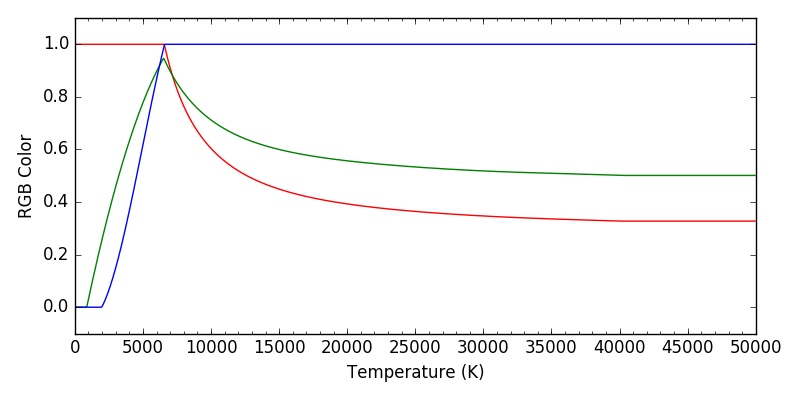

.. _example_temp_color:

Convert Blackbody Temperature to Real Color
===========================================

   Relation of black-body temperatures v.s. RGB colors.

Source Code
-----------

.. literalinclude:: temp_to_rgb.py
   :language: python

See also:

.. autosummary::
   stella.utils.vision.temp_to_rgb
